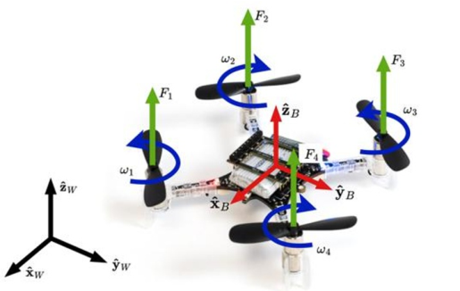
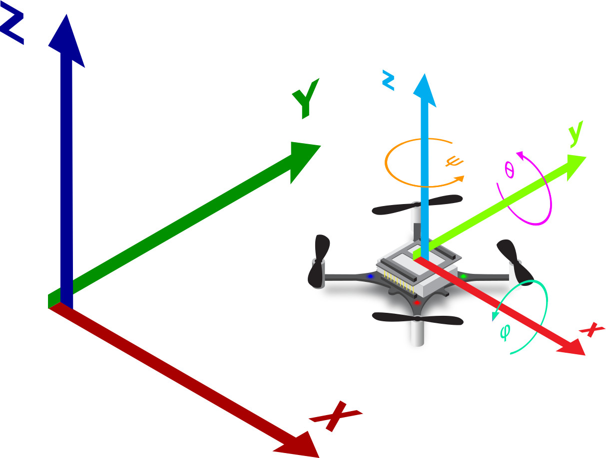
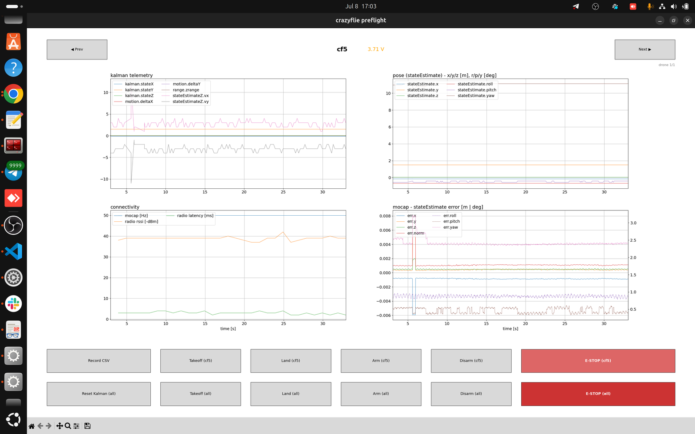
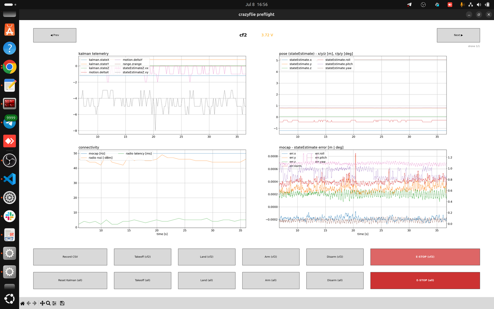
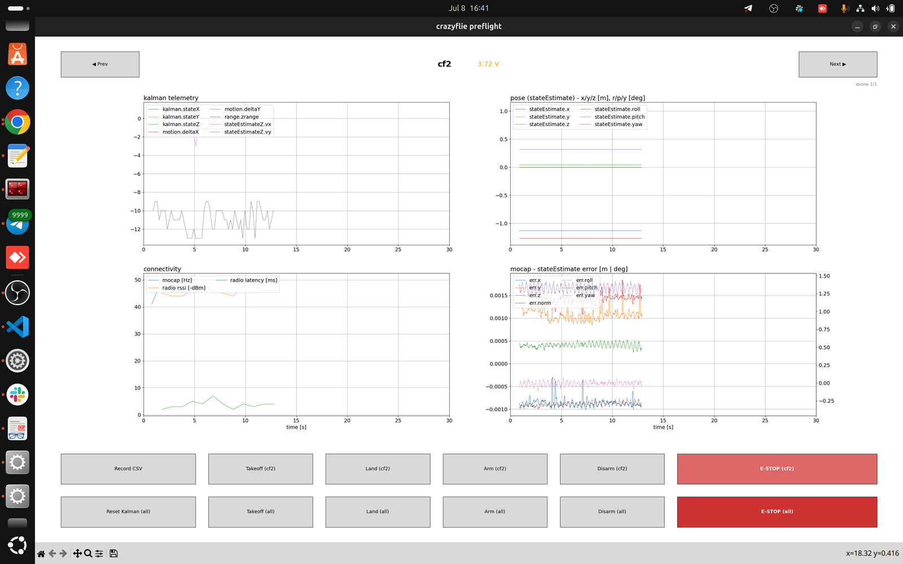
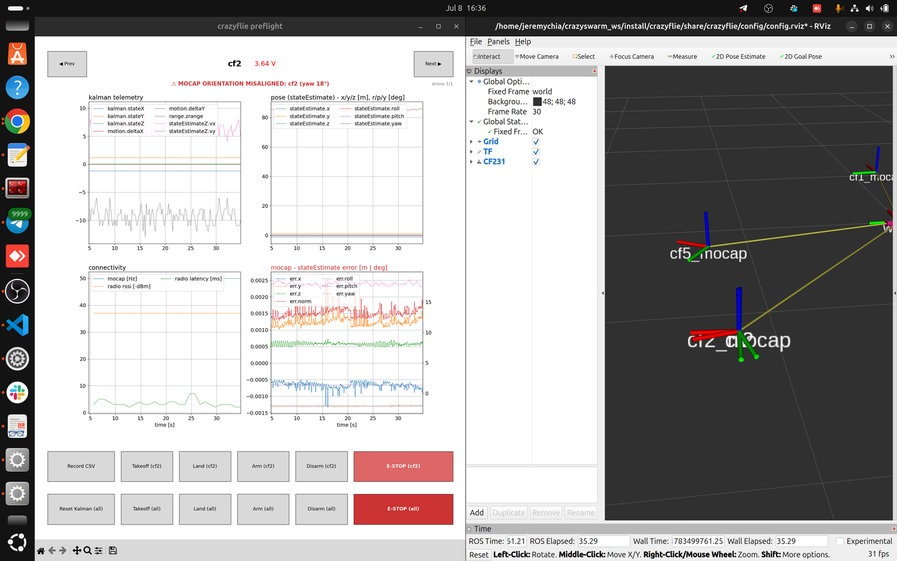
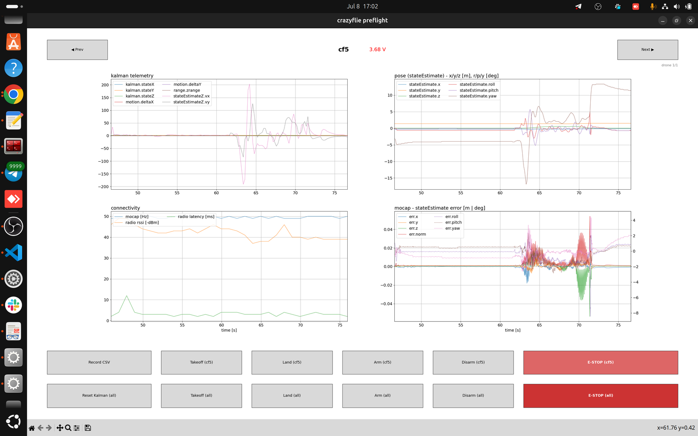

# CrazySwarm2

Reproducible setup for an indoor **Crazyflie 2.1 swarm** flown with **OptiTrack**
motion-capture localization, built on [Crazyswarm2](https://github.com/IMRCLab/crazyswarm2).

This is a **self-contained workspace**: the full source (our customized
`crazyswarm2` + `natnet_ros2`) is **vendored in [`src/`](src/)**, so a clone is a
byte-for-byte copy of the rig — no upstream fetching. One command installs the
dependencies and builds it on **Ubuntu 22.04 + ROS 2 Humble** or
**Ubuntu 24.04 + ROS 2 Jazzy**.

## Architecture

```
Motive / OptiTrack server (Windows)
        │  NatNet — Multicast @ 50 Hz
        ▼
  motion_capture_tracking  ──►  /poses  (NamedPoseArray)   [started by launch.py]
        │
        ▼
  crazyflie_server  ──►  Crazyradio USB ──►  Crazyflie 2.1 (cf1, cf2, …)
        ▲
        ├── user scripts via the crazyflie_py API
        └── preflight GUI + RViz  [both auto-started by launch.py]
            go/no-go checks: battery, mocap rate, mocap-vs-estimate error

  Alternative mocap path (open driver):
    Motive → natnet_ros2 → /<body>/pose → pose_bridge.py → /poses
```

| Component | Source | Role |
|-----------|--------|------|
| `crazyswarm2` | github.com/IMRCLab/crazyswarm2 | Crazyflie swarm server, sim, examples, Python API |
| `natnet_ros2` | github.com/L2S-lab/natnet_ros2 | OptiTrack / NatNet driver |
| `motion_capture_tracking` | apt (`rosdep`) | Converts mocap data → `/poses` for the server |
| `pose_bridge.py` | this repo | Aggregates per-body poses into `NamedPoseArray` |
| `preflight_kalman_plotter.py` | this repo (`src/crazyswarm2/crazyflie/scripts/`) | Preflight GUI — per-drone go/no-go checks before flight |
| `src/` (vendored) | this repo | Customized crazyswarm2 + natnet_ros2 (configs, launch.py, scripts) |

## Supported platforms

| Ubuntu | ROS 2 | Status |
|--------|-------|--------|
| 22.04 (Jammy) | Humble | supported |
| 24.04 (Noble) | Jazzy | supported |

The scripts auto-detect the pair from `/etc/os-release` (or an already-sourced
`$ROS_DISTRO`). Other combinations are rejected with a clear error.

## Setup

The full install lives here — there is no separate setup doc. `./scripts/setup.sh`
automates the workspace build, but **two things are deliberately left manual**
(marked below) because they are one-time, system-wide changes: installing ROS 2,
and Crazyradio USB permissions.

### Step 1 — Install ROS 2  *(manual; `setup.sh` does NOT do this)*

`setup.sh` requires ROS 2 to already be installed and will stop with an error if
it isn't. Install it once. The block below auto-detects the right distro
(Humble on 22.04, Jazzy on 24.04) — just copy-paste it whole:

```bash
# auto-detect the ROS 2 distro from your Ubuntu version
source /etc/os-release
case "$VERSION_ID" in
  22.04) export ROS_DISTRO=humble ;;
  24.04) export ROS_DISTRO=jazzy  ;;
  *) echo "Unsupported Ubuntu $VERSION_ID — need 22.04 or 24.04"; return 2>/dev/null || exit 2 ;;
esac
echo "Installing ROS 2 $ROS_DISTRO"

# enable the ROS 2 apt repository
sudo apt update && sudo apt install -y software-properties-common curl
sudo add-apt-repository universe -y
sudo curl -sSL https://raw.githubusercontent.com/ros/rosdistro/master/ros.key \
  -o /usr/share/keyrings/ros-archive-keyring.gpg
echo "deb [arch=$(dpkg --print-architecture) signed-by=/usr/share/keyrings/ros-archive-keyring.gpg] \
http://packages.ros.org/ros2/ubuntu $(. /etc/os-release && echo $UBUNTU_CODENAME) main" \
  | sudo tee /etc/apt/sources.list.d/ros2.list > /dev/null

# install ROS 2 (desktop = includes RViz) and dev tools
sudo apt update
sudo apt install -y ros-${ROS_DISTRO}-desktop ros-dev-tools

# source it now and on every new shell
source /opt/ros/${ROS_DISTRO}/setup.bash
echo "source /opt/ros/${ROS_DISTRO}/setup.bash" >> ~/.bashrc
```

> Reference: official ROS 2 install guide —
> [Humble](https://docs.ros.org/en/humble/Installation.html) /
> [Jazzy](https://docs.ros.org/en/jazzy/Installation.html).

### Step 2 — Clone and run the one-shot setup

```bash
git clone https://github.com/jeremyCHH/CrazySwarm2.git ~/CrazySwarm2
cd ~/CrazySwarm2
./scripts/setup.sh
```

The source is already in `src/`, so `setup.sh` just:

1. `scripts/install_deps.sh` — apt deps + `rosdep install` (pulls `motion_capture_tracking`).
2. `scripts/build.sh` — `colcon build --symlink-install` at the repo root.

Re-run any step on its own later:

```bash
./scripts/install_deps.sh        # deps only
./scripts/build.sh               # rebuild everything
./scripts/build.sh crazyflie     # rebuild one package
LOW_MEM=1 ./scripts/build.sh     # serial build on low-RAM machines
```

### Step 3 — Crazyradio USB permissions  *(manual; hardware only)*

Skip this if you only run the simulator. It lets your user talk to the Crazyradio
without `sudo` — `setup.sh` does NOT do this:

```bash
sudo groupadd plugdev 2>/dev/null; sudo usermod -aG plugdev $USER
cat <<'EOF' | sudo tee /etc/udev/rules.d/99-bitcraze.rules > /dev/null
# Crazyradio (PA) and Crazyradio 2.0
SUBSYSTEM=="usb", ATTRS{idVendor}=="1915", ATTRS{idProduct}=="7777", MODE="0664", GROUP="plugdev"
SUBSYSTEM=="usb", ATTRS{idVendor}=="1915", ATTRS{idProduct}=="0101", MODE="0664", GROUP="plugdev"
# Crazyflie 2.x over USB
SUBSYSTEM=="usb", ATTRS{idVendor}=="0483", ATTRS{idProduct}=="5740", MODE="0664", GROUP="plugdev"
EOF
sudo udevadm control --reload-rules && sudo udevadm trigger
# log out / back in for the group change to take effect
```

Reference: [Bitcraze USB permissions guide](https://www.bitcraze.io/documentation/repository/crazyflie-lib-python/master/installation/usb_permissions/).

### Step 4 — Simulator firmware bindings (`cffirmware`)  *(simulator only)*

The simulator backend (`backend:=sim`) imports the Crazyflie firmware Python
bindings (`cffirmware`) for software-in-the-loop control. These are **not** a pip
package and are **not** needed for hardware flight — only for the simulator. Build
them once (clones crazyflie-firmware outside the workspace, builds + installs the
bindings into your user site-packages):

```bash
./scripts/setup_sim_firmware.sh
source ~/.bashrc                       # the script adds the bindings to PYTHONPATH
cd ~ && python3 -c "import cffirmware; print('cffirmware OK')"   # verify (not from build/)
```

The script installs `git-lfs` (the firmware's CMSIS submodule needs it) and adds
the compiled bindings to `PYTHONPATH` via `~/.bashrc`, so open a new shell (or
`source ~/.bashrc`) before launching the simulator.

### Step 5 — Activate and smoke-test

```bash
source /opt/ros/$ROS_DISTRO/setup.bash
source ~/CrazySwarm2/install/setup.bash
ros2 launch crazyflie launch.py backend:=sim   # needs Step 4; no hardware/mocap
```

> **Building by hand.** `setup.sh` already builds the workspace, but to (re)build
> manually — e.g. after editing source, or to see raw colcon output:
> ```bash
> cd ~/CrazySwarm2
> source /opt/ros/$ROS_DISTRO/setup.bash
> colcon build --symlink-install --cmake-args -DCMAKE_BUILD_TYPE=Release
> source install/setup.bash
> ```
>
> **Notes.** If `rosdep` can't find `motion-capture-tracking` on your distro, clone
> it into `src/` (`git clone --branch ros2 --recursive
> https://github.com/IMRCLab/motion_capture_tracking.git src/motion_capture_tracking`)
> and rebuild. On low-RAM machines use `LOW_MEM=1 ./scripts/build.sh`.

## Running the real drone

First, in **Motive** set Data Streaming to **Multicast** at **50 Hz** — this must
match `src/crazyswarm2/crazyflie/config/motion_capture.yaml`. Then:

```bash
# terminal 1 — Crazyflie server. Also starts mocap tracking, RViz, the
# preflight GUI and the Foxglove bridge (all on by default;
# rviz:=false / preflight:=False to disable)
ros2 launch crazyflie launch.py

# run the preflight checklist in the GUI (banner clear, mocap ~50 Hz,
# err.yaw ≈ 0°, battery green) — see docs/RUNNING.md → Preflight GUI

# terminal 2 — takeoff, hover, land
ros2 run crazyflie_examples hello_world
```

### What to expect after launch

`ros2 launch crazyflie launch.py` starts the server **and** three helper
surfaces (all on by default):

- **RViz** — you should see each drone's onboard EKF estimate (`cf1`) and its
  mocap frame (`cf1_mocap`) sitting **on top of each other**. Axes that are
  offset or rotated relative to each other mean a frame/orientation problem
  (see the misalignment example below).
- **Preflight GUI** (`crazyflie preflight`) — the per-drone go/no-go dashboard
  described next. One drone is shown at a time; **Prev/Next** (or ←/→) cycles
  through the enabled drones.
- **Foxglove bridge** — needs the package
  (`sudo apt install ros-$ROS_DISTRO-foxglove-bridge`) and is viewed from the
  Foxglove Studio app, not a window of its own.

If a drone is missing from the GUI it is `enabled: false` in `crazyflies.yaml`.
If the mocap-Hz trace never rises off zero, mocap isn't reaching the server —
see [docs/TROUBLESHOOTING.md](docs/TROUBLESHOOTING.md#mocap-pipeline).

## PreFlight Checks

The **preflight GUI** is the go/no-go check before *every* flight. It shows four
panels (kalman telemetry, pose/`stateEstimate`, connectivity, and
mocap-vs-onboard error) plus per-drone and all-drone **Takeoff / Land / Arm /
Disarm / E-STOP** buttons and **Record CSV**. A drone with the **Color LED deck**
lights **green when the server connects** and goes dark on clean shutdown — a
lit LED is itself a "link up" preflight signal. Full walkthrough:
[docs/RUNNING.md](docs/RUNNING.md#c-preflight-gui-preflight_kalman_plotterpy).

**Checklist — run through this before every test flight / debugging session:**

- [ ] **1. Battery is not red** — header voltage shows green (or at worst orange); red < 3.7 V means charge or swap the pack first ([see battery example](#img-preflight-battery)).
- [ ] **2. Mocap and radio signal steady** — `mocap [Hz]` flat at ~50 Hz, RSSI steady, latency low and not spiking ([see healthy graph](#img-preflight-healthy)).
- [ ] **3. No error between mocap and drone orientation** — no red misalignment banner and dashed `err.yaw` near 0°. If misaligned, position the drone in the same orientation as the mocap rigid body — [how to align the drone axis to the mocap axis](#hangar-axes) — and recreate the rigid body in Motive ([see what a violation looks like](#img-preflight-misaligned)).
  > **Good practice:** each time a human enters the mocap zone, reset the rigid body in Motive — bumped markers or an occluded view can silently shift the body's orientation.
- [ ] **4. Kalman estimation converging near 0 at rest** — the kalman telemetry and error traces settle near zero while the drone sits still. If not, reset the drone by replugging its battery (or press **Reset Kalman (all)** / `r` in the GUI), then re-check ([see healthy example](#img-preflight-healthy)).

<a id="hangar-axes"></a>

**Axis alignment — drone ↔ mocap.** The GUI's `err.yaw` reads ~0° only when the
rigid body was created with the drone's body frame aligned to the mocap global
frame. How to do it:

1. **Find the drone's front.** On the Crazyflie the *Front direction* is the notch
   between motors **M1** and **M4** (the arm pair with the red/green LEDs; the PCB
   is marked `UP → FRONT`). Body frame: **X forward, Y left, Z up** — see the
   [Bitcraze coordinate-system reference](https://www.bitcraze.io/documentation/system/platform/cf2-coordinate-system/).
2. **Find the hangar's +X.** Our mocap global frame is **Z-up** with **+X** running
   across the floor exactly as annotated in the photos below (origin at the cross
   on the carpet).
3. **Align and create.** Set the drone flat on the floor with its front pointing
   along the hangar's **+X**, then create (or reset) the rigid body in Motive
   while it sits like that. Done right, the dashed `err.yaw` trace sits at ~0°
   and the axes overlap in RViz.

*Crazyflie body frame — annotated on the real airframe (left: body axes
x̂_B/ŷ_B/ẑ_B, motor thrusts F₁–F₄ and spin directions, world frame in the corner)
and as a diagram with the roll/pitch/yaw rotations (right):*

 

*Hangar mocap frame (+X across the floor, Z up; origin cross close-up on the right):*

 

### Emergency stop (E-STOP) demo

Every drone has an **E-STOP** button in the preflight GUI (and the `e` key) that
cuts motors instantly; **E-STOP (all)** kills the whole swarm at once. Know where
it is before you arm anything. Short demo:


▶️ [Full-quality video with audio](video/crazyfly_estop_draft1.mp4) (opens GitHub's player / downloads)

<!-- OPTIONAL upgrade to a real inline player with audio: drag
     video/crazyfly_estop_draft1.mp4 into the GitHub web editor for this README
     (pencil ✏️ → drag the file into the text area). GitHub uploads it and inserts
     a https://github.com/user-attachments/assets/<id> URL; paste that URL on its
     own line here and delete the GIF above if you prefer. -->

### Reading the GUI

Clear the drone against these before arming:

| Check | Where | Healthy | Go / no-go |
|-------|-------|---------|-----------|
| **Battery** | header voltage | **green > 3.8 V** | **orange 3.7–3.8 V** = fly but land soon; **red < 3.7 V** = **NO-FLY** (charge/swap). `(charging)` = NO-FLY until unplugged. |
| **Mocap rate** | connectivity → `mocap [Hz]` | flat **~50 Hz** | sagging or decaying toward 0 = mocap dying → **NO-FLY** |
| **Radio** | connectivity → `rssi` / `latency` | rssi steady, latency low & flat | erratic / climbing latency = saturated radio (lower logging/mocap rate) |
| **Orientation** | error panel → dashed `err.yaw` + red banner | **\|err.yaw\| ≤ 5°** | 5–15° **fix first**; **> 20° NO-FLY**; the red *"MOCAP ORIENTATION MISALIGNED"* banner fires above 10° |
| **Estimator fusion** | error panel → `err.x/y/z/norm` | small & steady (~mm) | diverging = Kalman not fusing mocap → **NO-FLY** |

> **Don't be reassured by tiny position error.** `locSrv.extPosStdDev` force-fuses
> mocap position, so `err.x/y/z` stays ~1 mm *even when the rigid body is defined
> rotated* — that offset is invisible at rest but becomes a **fly-away** in the
> air. The orientation error (`err.yaw`) and the banner are what catch it. Press
> **`r`** to reset the Kalman filter (all drones); **`e`** is E-STOP.

<a id="img-preflight-healthy"></a>

**Healthy preflight (Flow deck fitted).** All four panels steady, `mocap ~50 Hz`,
`err.yaw` ≈ a couple of degrees. Battery here is 3.71 V (orange) — flyable, but
plan to land and swap soon.



**Healthy preflight (no Flow deck).** With no Flow deck the flow/range channels
(`motion.deltaX/Y`, `range.zrange`, `stateEstimateZ.vx/vy`) sit flat or noisy —
**this is expected, not a fault.** Judge such a drone on mocap, battery and yaw.



<a id="img-preflight-battery"></a>

**Warning-band battery.** 3.72 V shows orange: still flyable, but you're near the
warning threshold — do a short flight and recharge.



<a id="img-preflight-misaligned"></a>

**NO-FLY — orientation misaligned + low battery.** The red banner reads
*"MOCAP ORIENTATION MISALIGNED: cf2 (yaw 18°)"*, `err.yaw` (dashed) climbs toward
15°, and RViz (right) shows the `cf2_mocap` axes visibly rotated. Battery is
3.64 V (red). Do **not** fly: recreate the Motive rigid body with the drone's
forward axis on global **+X** ([docs/MOCAP.md](docs/MOCAP.md#2-defining-rigid-bodies))
and charge the pack.



### What a flight looks like

During takeoff/hover/land the kalman, pose and error panels show real motion —
transient swings and error spikes while the drone moves — then settle back when
it lands. **`mocap [Hz]` should stay pinned at ~50 Hz the whole time**; a drop
mid-flight is the mocap failure that triggers an emergency land. Note the battery
sags under load (3.68 V, red, after the flight below):



Hover/landing height and durations are set in `hello_world.py` — see
[docs/RUNNING.md](docs/RUNNING.md#adjusting-the-flight-hello_worldpy).


## Documentation

- [docs/RUNNING.md](docs/RUNNING.md) — sim, hardware, mocap launch flows; the preflight GUI; custom logging
- [docs/MOCAP.md](docs/MOCAP.md) — OptiTrack calibration, rigid bodies, 240→50 Hz tuning
- [docs/TROUBLESHOOTING.md](docs/TROUBLESHOOTING.md) — common failures

## Configuration

The source (and its config) is vendored, so **edit files directly in `src/`** and
commit — a fresh clone then reproduces your exact rig. Key files:

- `src/crazyswarm2/crazyflie/config/crazyflies.yaml` — drone list, URIs, types, firmware logging.
- `src/crazyswarm2/crazyflie/config/motion_capture.yaml` — Motive hostname/IP, markers, QoS.
- `src/crazyswarm2/crazyflie/config/server.yaml` — warning thresholds, sim backend/controller.
- `src/crazyswarm2/crazyflie/config/teleop.yaml` — gamepad mapping.
- `src/crazyswarm2/crazyflie/launch/launch.py` — customized (adds the **foxglove_bridge**
  and **preflight GUI** nodes; `rviz` default `True`, `gui` default `False`).
- `src/crazyswarm2/crazyflie/scripts/preflight_kalman_plotter.py` — the preflight GUI
  (thresholds and takeoff/land setpoints are constants at the top).

`pose_bridge.py` `DRONES` and `PUBLISH_HZ` must match `crazyflies.yaml` and the
Motive streaming rate — see [docs/MOCAP.md](docs/MOCAP.md).

After editing anything in `src/`, rebuild: `./scripts/build.sh` (or just the
changed package, e.g. `./scripts/build.sh crazyflie`).

## Repo layout

```
CrazySwarm2/
├── src/                  # VENDORED source — crazyswarm2 + natnet_ros2 (committed)
├── scripts/              # setup.sh, install_deps.sh, build.sh, setup_sim_firmware.sh
├── pose_bridge.py        # natnet → /poses bridge (50 Hz)
├── docs/                 # RUNNING, MOCAP, TROUBLESHOOTING
├── CLAUDE.md
└── build/  install/  log/   # generated, git-ignored
```

## Provenance

`src/` was vendored from these upstreams (with local customizations):

- `crazyswarm2` — github.com/IMRCLab/crazyswarm2 (`ae23edc`)
- `natnet_ros2` — github.com/L2S-lab/natnet_ros2 (`883b095`)

To pull upstream changes, diff against those and merge manually, or re-vendor.
